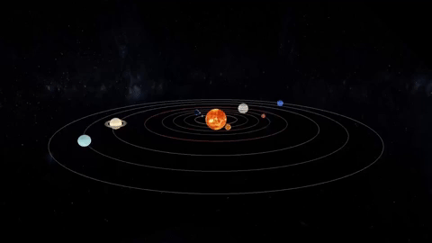

<h1>Solar-system-project</h1>

Modelagem e visualização do sistema solar usando OpenGL em c++ utilizando de aspectos de texturas e transformações matriciais. Projeto final da disciplina de Computação Gráfica (DCA0114) na Universidade Federal do Rio Grande do Norte.

<h2>Dependências</h2>

*   OpenGL
*   GNU GCC compiler

<h2>Observação</h2>

Caso o usuário seja utilizador do sistema operacional Windows e deseje executar o código e utilizar do OpenGL, recomenda-se seguir o seguinte [guia](https://medium.com/swlh/setting-opengl-for-windows-d0b45062caf) para instalação das dependências.

<h2>Instalação</h2>

    git clone https://github.com/reilta/solar-system-project

<h2>Executando o código</h2>

    g++ -o main -lopengl32 -lglu32

<h2>Controles</h2>

*   **a** - move a câmera para esquerda
*   **d** - move a câmera para direita
*   **w** - move a câmera para frente
*   **s** - move a câmera para trás
*   **q** - move a câmera para cima
*   **e** - move a câmera para baixo

*   **i** - incrementa a inclinação da câmera
*   **I** - decrementa a inclinação da câmera

*   **z** - zoom in
*   **Z** - zoom out
*   **r** - rotaciona a câmera no sentido horário
*   **R** - rotaciona a câmera no sentido anti-horário

*   **p** - rotaciona os objetos no próprio eixo
*   **y** - rotaciona os objetos em torno do ponto inicial
*   **g** - rotação automática dos objetos

